# GuideZotero

This is a very short and simple guide to use Zotero, the reference manager that will help you, not having to ever ever ever type a reference yourself and avoiding errors in the references.

 Guide for Zotero

 1)	Download Zotero, make sure to download the desktop application and the plug-ins for the browser: Firefox, Safari, etc.

 

 2)	Never ever ever type a reference unless you cannot find it, and then if you cannot find it in PubMed, Scopus, ScienceDirect, IEEE XPlore etc. it is probably a reference you do now want to use. You should find the reference of your interest and then click the “Add to zotero” button in the browser. (you need to have the zotero app running)

  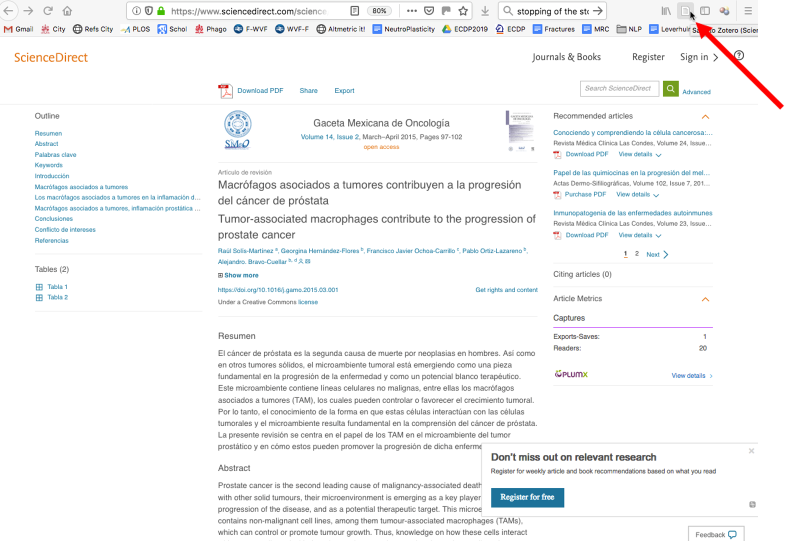

 3)	You click and zotero will automatically add to your library.

 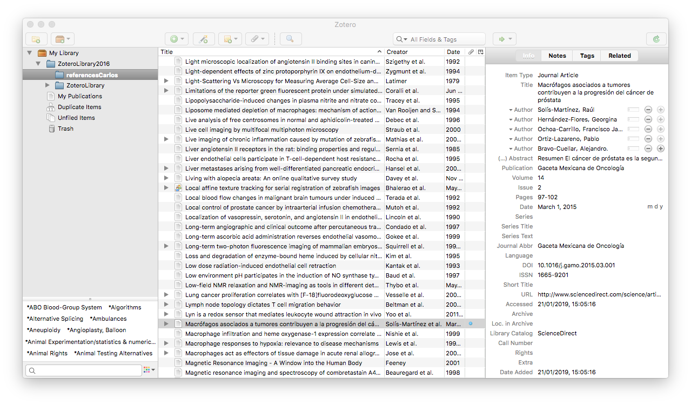

 4)	To use the references in latex/overleaf,  (word use is below) open the preferences and in the Tab CITE, select Style Preview (this image is from MAC, in Windows is slightly different)

 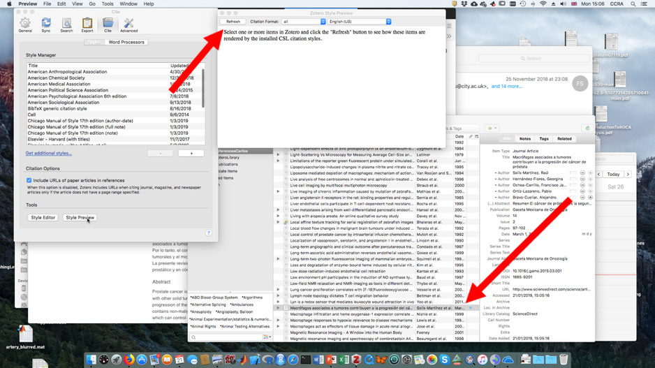

 5)	Select the reference you want to export to latex and then click refresh in the style preview window. The window will refresh with a preview of the way the reference will look with different bibliography styles. Scroll to BIBTEX, if you cannot see this, make sure you have it enabled

 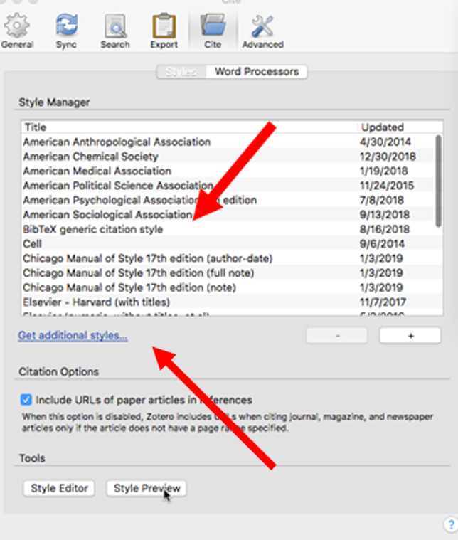

 6)	 The preview window will display the .BIB entry of the reference.

 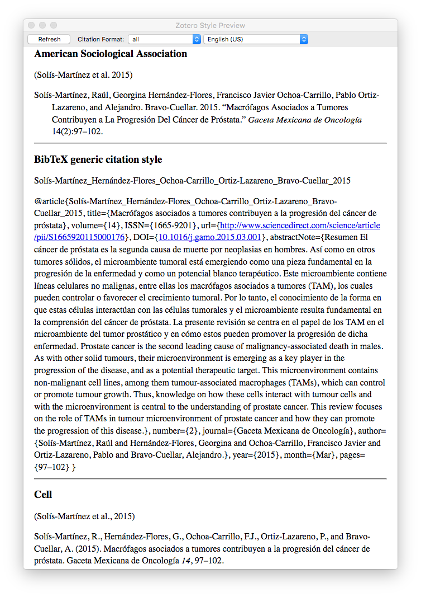

 7)	 Copy the text (@article{Solís-Martínez_Hernández-Flores_Ochoa-Carrillo_Ortiz-Lazareno_Bravo-Cuellar_2015, title={Macrófagos asociados a tumores contribuyen a la progresión del cáncer de próstata}, volume={14}, ISSN={1665-9201},…) to Overleaf. It is good practice to paste in a separate file like references.bib

 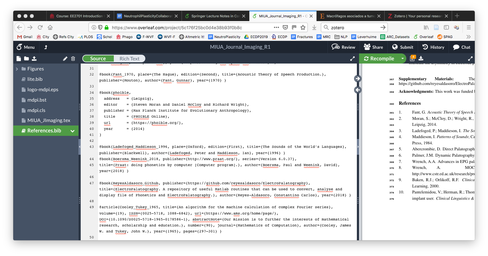

 8)	 Place all the necessary references in that file. It is important that each entry has the correct identifier (@book, @article, @inproceedings, etc. ) and not just @bibitem. As different styles manage books and journal papers in different ways and @bibitem does not take these distinctions. At the end of the document add a line for the bibliography:

 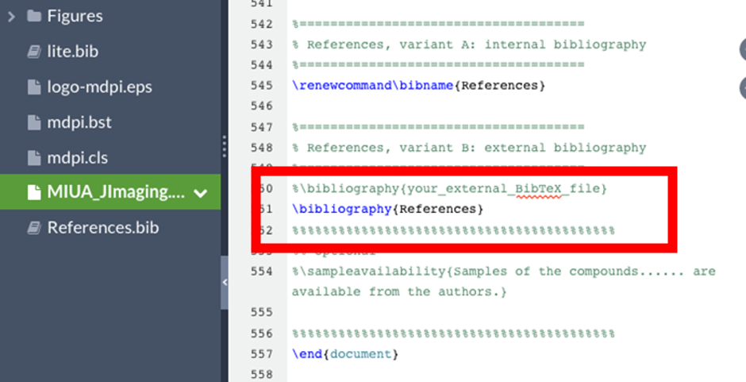

 9)	To use Zotero with Word, you will need to install the Plug-In
 https://www.zotero.org/support/word_processor_integration

 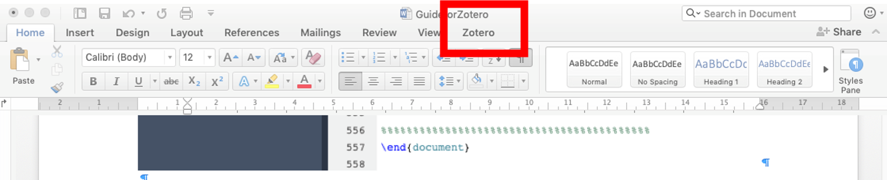

 10)	When you click on the zotero tab, it will give you the options to add citations, add bibliography and select preferences.

 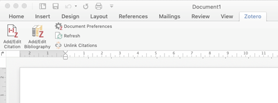

 11)	 When you insert the first reference, you will be asked for the Citation Style, if you do not know which to use, select IEEE. If you do not have IEEE (or any other) you can click on “Manage Styles” and add new styles

 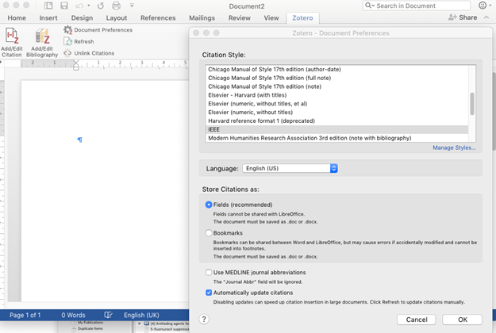

 12)	After the citation style, you will have a small window where you can look for the reference, it will search for the authors, so for instance to look for Hawkins, type “Haw” and you will be given the all the options that contain those letters. Notice that you first have to have added the references to Zotero.

 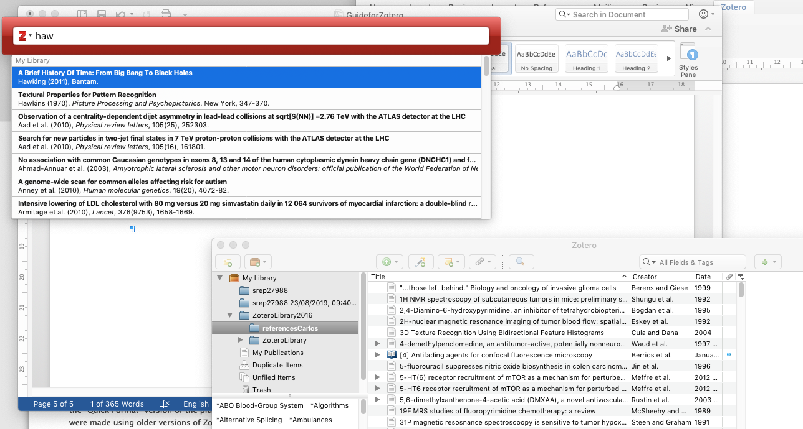

 13)	Click enter after the reference and the reference (numerical as it is IEEE) will be inserted where your cursor was located.:

 (1)

 14)	Once you have added all your references, select “add bibliography  and the bibliography will be added:

 [1]	S. Hawking, A Brief History Of Time: From Big Bang To Black Holes. Bantam, 2011.

 If you need to change the Style, say from Nature to Vancouver or Harvard, click Document Preferences, and select the new style,

 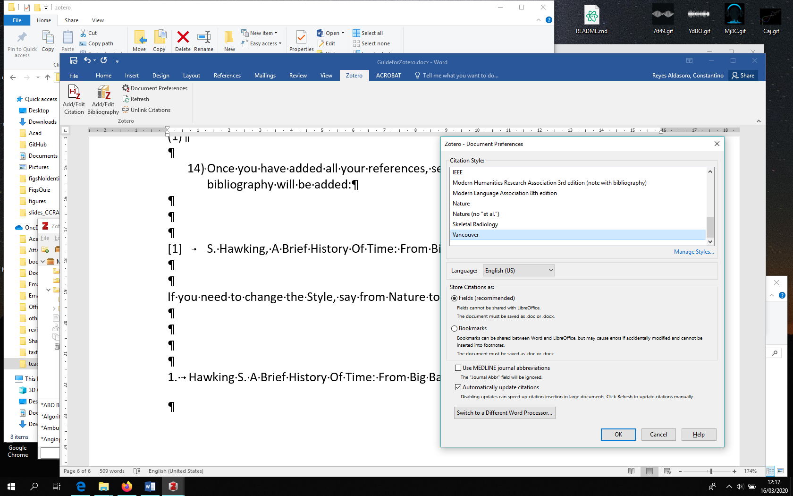

 The reference will be updated. If you change the text and then one reference is after where it was previously, Zotero will re-order automatically.

 1. 	Hawking S. A Brief History Of Time: From Big Bang To Black Holes. Bantam; 2011. 256 p.
